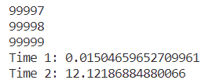

<!-- omit in toc -->
# 热力学实验采集程序文档

<!-- omit in toc -->
# 目录
- [0. 写在前面](#0-写在前面)
- [1. 核心知识介绍](#1-核心知识介绍)
  - [串口通信与缓存](#串口通信与缓存)
  - [图形界面与多线程](#图形界面与多线程)
- [2. 运行环境配置](#2-运行环境配置)
  - [2.1 虚拟环境配置](#21-虚拟环境配置)
  - [2.2 包安装](#22-包安装)
  - [2.3 启动程序](#23-启动程序)
  - [2.4 打包可执行文件](#24-打包可执行文件)
- [3. 程序各部分功能](#3-程序各部分功能)
  - [3.1 water\_capacity\_smooth.py](#31-water_capacity_smoothpy)
  - [3.2 water\_density\_smooth.py](#32-water_density_smoothpy)
  - [3.3 expserial.py](#33-expserialpy)
  - [3.4 maths.py](#34-mathspy)
  - [3.5 gui.py](#35-guipy)
  - [3.6 main.py](#36-mainpy)

# 0. 写在前面

欢迎！如你所见，这是介绍这个程序如何设计，怎么构成的一篇文档。如果只是想看程序如何使用，那么请看另一篇《热力学实验采集程序使用说明》。

这个程序主要由Python 3书写，因此，在开始之前，我希望你能有如下准备：

- 电脑上安装有Python 3.9及以上版本
  + 我们并未测试过更低版本的是否能正常使用，但我们是使用Python 3.9进行编写的
- 了解Python 3基本语法知识
- 知道如何打开终端（如cmd、PowerShell或者代码编辑器如VSCode里的终端）
- 会执行cd、python、pip等命令

# 1. 核心知识介绍

## 串口通信与缓存

程序需要在电脑上获取从温差仪传入的数据。当我们把两台机器用USB连接上时，测量仪会把它的温差数据按一定格式一位一位传给电脑，这种按位传递方式就叫做串口通信。串口通信需要双方约定好传输的波特率，即状态数传输的速率。如果不统一，就无法读出正确的信息。

串口通信是一个较为复杂的过程，我们这里略去技术细节，只考虑和我们实现相关的一个概念：**缓存**。当一个程序有大量输入输出时，这个程序会很慢，就像下面展示的那样，Time 1是for循环里有一个平方根运行的时间，Time 2是在for循环里有print运行的时间。由此可以看出print这种输入输出是相当慢的。



为了更快，人们对这种输入输出采用了缓存机制。即要输出东西时，电脑暂时不先把这些东西输出，而是存到一块区域存起来，当这块区域填满时再一起输出，从而节省输出的次数。输入也是类似的，串口传进来的数据会传到一个地方先存起来，由程序读出来。这样效率更高，但是有一个问题：我们希望读到的是实时数据，但输入缓存区的读入的数据是最早的数据，可能已经是几秒以前的数据了。因此当我们读实时数据的时候需要把缓存清空。

## 图形界面与多线程

一般在简单的教学中，Python程序都是在一个框里跑，用input函数输入字符，print函数输出字符。但这和我们日常使用的程序大不相同，日常的程序都有按钮、输入框、错误弹窗等等多样的交互。这种日常的程序使用了**图形界面**，以便降低软件的使用门槛。我们的程序也不能例外。为简便，我们使用了python自带的模块`tkinter`实现，接下来的图形界面的逻辑基于`tkinter`的逻辑介绍。

图形界面的具体实现，比如一个窗口以及上面个的按钮是怎么显示的，这个问题较为复杂，不在我们的讨论范围内。我们主要关注图形界面交互，比如按下按钮时发生了什么。

当程序启动图形界面时，程序首先会进行一些初始化，比如对窗口进行布局。然后，程序会进入一个称为**事件循环**的循环中，不断侦听有无事件产生。如果有事件，比如按钮按下发出的事件，或者关闭窗口的事件，那么就对相应事件进行处理响应。每一轮循环处理完成后，窗口更新等待处理接下来的事件。


我们的程序的功能中有一个定时读取数据的功能。一个非常简单的方式是将这个读取数据的功能放在一个无限循环里。如果只是要读数据，这是可行的，然而，这个程序将永远无法结束。你的程序会卡住，按任何按钮都无法反应。这是因为程序现在在处理无限循环读数，无法处理你新提供给它的事件，程序便无响应。


Python文档对这种事情提供了一种解决方案：使用**多线程**。多线程可以简单理解为两个任务分步推进，看起来就像是同时进行的一样。这样就可以做到快速响应。


# 2. 运行环境配置

## 2.1 虚拟环境配置

这个程序用到了各种各样的模块，所需模块列在了requirements.txt里面。你可能会选择使用pip直接安装。然而这并不是最好的方式。运行环境需要一个模块`pyserial`，这是用来对串口进行操作的，但我想这个模块在这次实验以外就几乎不会用到了。但反正这个模块也不大，如果不介意这个模块留在全局的Python里，或者不嫌uninstall麻烦，那直接安装就好了，可以直接看下一节。如果介意的话，这里介绍一种技术**虚拟环境**，想必能解决这个问题。

**虚拟环境**相当于是把你电脑上原本的Python环境复制一份，当你进入虚拟环境时，你做的所有对Python的操作都只会影响这个新的Python，而对老的Python没有影响。并且，尽管在本实验中没有影响，虚拟环境还可以使电脑上使用不同版本的模块。比如一个程序需要使用Django 1.0，一个需要Django 2.0。如果全装在全局Python底下就会引发冲突，虚拟环境可以解决这个问题。此外，如果要把程序打包成exe等可执行格式，使用虚拟环境可以指打包你需要的模块，减少程序的大小。

有非常多的软件提供了虚拟环境功能，比如Anaconda。但为简便，这里我们使用Python原本自带的一个工具，`venv`。

首先打开终端（建议把路径导到程序目录下），在终端中输入如下命令

```sh
python -m venv virtualenv
```

做完这步操作后，你会发现在当前文件夹底下多出了一个名为`virtualenv`的文件夹，这就是虚拟环境所需要的全部信息。你也可以改动上述命令的最后一项以改动文件夹名，只要记着之后相关的命令都改掉就行。在该文件夹的`Lib/site-packages`文件夹下存放着所需的所有包。当然，现在看的话里面除了一些必要的工具如pip以外应该几乎没有东西，因为我们还没有把需要的包安装上。

接下来我们需要启动虚拟环境，在相同目录下运行如下命令。**注：这步在不同操作系统上可能不同，这里以Windows系统为例**

```sh
./virtualenv/Scripts/activate
```

这步命令的意思是运行一个启动虚拟环境的程序`activate`，在这步做完之后，你应该会在终端里看到如下结果

```sh
(virtualenv)你的程序路径> 
```

如果在最前面出现了一个括号包着你的虚拟环境文件夹名，那么虚拟环境就成功启动了。想要退出也可以，输入如下命令即可。

```sh
deactivate
```

## 2.2 包安装

接下来我们需要安装程序需要的包，如果用了虚拟环境记得先启动。这里我们用最常用的pip。为方便，我们将所需的模块放在了`requirements.txt`中。在程序文件夹中执行如下命令即可安装。

```sh
pip install -r requirements.txt
```

这步的意思是让pip去安装`requirements.txt`里所有列出的包。

## 2.3 启动程序

最后为了检验环境是否配置正确，我们启动一下程序看看。

在程序文件夹下运行

```sh
python main.py
```

如果电脑不支持`python`命令，这里的`python`可以换成`py`、`python3`。如果都不行，你可以直接用Python的完整路径替代。Windows系统下的虚拟环境可以用`./virtualenv/Scripts/python.exe`替代。如果怀疑打开了错误的Python（比如发现找不到已经安装的模块），你可以用如下命令检验打开的Python是否是你想要的Python。

```sh
python -c "import sys;print(sys.executable)"
```

这个命令可以打印当前Python解释器的路径，如果确实是对应路径下的Python，那就没问题了。

## 2.4 打包可执行文件

TODO

# 3. 程序各部分功能

## 3.1 water_capacity_smooth.py

水比热容数据。数据来自CRC Handbook of Chemistry and Physics, 95th Edition并进行了三次插值。

**water_capacity_smooth** 温度与比热容关系的字典，温度为键，比热容为值，都为字符串格式

## 3.2 water_density_smooth.py

水密度数据。数据来自CRC Handbook of Chemistry and Physics, 95th Edition并进行了三次插值。

**water_density_smooth** 温度与密度关系的字典，温度为键，密度为值，都为字符串格式

## 3.3 expserial.py

本模块针对实验打包了一个串口，简化serial的实现。

函数**getComPorts(select,timeout)**：返回所有可用端口列表
- 参数 `select`： 是否要自动根据端口状态选择端口，为True时忽略产生错误和读数超时的端口，默认为False
- 参数 `timeout`： 端口超时时间，单位：秒，如果等待该事件没有数据传入，该端口将被忽略，默认为0.25
- 返回值：所有可用端口列表

函数**derive_Delta_T(msg)**：根据传入字节返回温度
- 参数 `msg`：读取到的7长度字节串
- 返回值：温差，float

类**EasySerial**：将serial的Serial打包成在本实验中更易使用的结构
- 初始化参数 `name`：端口名称，如“COM3”
- 初始化参数 `baud`：波特率，本实验中为1200
- 方法 `setName(name)`：改变端口名
- 方法 `open()`：打开端口
- 方法 `read()`：读取温差数据
  + 返回值：温差，float
- 方法 `close()`：关闭端口

## 3.4 maths.py

函数**linear_regression(csv, Start, End)**：在`csv[Start:End+1]`上的线性回归
- 参数`csv`：待线性回归数据
- 参数`Start`：线性回归起点，含该点
- 参数`End`：线性回归终点，含该点
- 返回值：斜率、截距、斜率标准差、截距标准差、相关系数平方

函数**integration(x,y,k,b,dx)**：对函数f(x)=y-kx-b下x处梯形面积
- 参数`x`,`y`,`k`,`b`：上述函数的参数
- 参数`dx`：梯形高
- 返回值：梯形面积

函数**B_Spline(x, y, dx)**：B-样条平滑曲线
- 参数`x`,`y`：B-样条平滑曲线上的点
- 返回值：B-样条平滑函数

函数**Reynolds(csv, Start1, End1, Start2, End2, dx)**：雷诺校正
- 参数`csv`：待雷诺校正数据
- 参数`Start1`,`End1`,`Start2`,`End2`：雷诺校正两端线性回归区域（闭区间）
- 参数`dx`：分辨率，即校正线横坐标可偏移的最大范围
- 返回值：雷诺校正线横坐标，校正线左侧积分面积，校正线右侧积分面积
  
函数**calculate_dissolution(parameters)**：溶解热计算
- 参数`parameters`，参数字典，需要有如下键值对
  + `T1_left` 第一处雷诺校正左侧线性拟合温度，单位(K)
  + `T1_right` 第一处雷诺校正右侧线性拟合温度，单位(K)
  + `T2_left` 第二处雷诺校正左侧线性拟合温度，单位(K)
  + `T2_right` 第二处雷诺校正右侧线性拟合温度，单位(K)
  + `R1(Omega)` 单轮实验前电阻，单位(Ω)
  + `R2(Omega)` 单轮实验后电阻，单位(Ω)
  + `t1(s)` 开始加热时间点，单位(s)
  + `t2(s)` 结束加热时间点，单位(s)
  + `current(A)` 加热电流大小，单位(A)
- 返回值：参数字典`parameters`。原参数字典中，`dissolution_heat(kJ)`一项对应的值变动为计算出的溶解热效应，单位(kJ)

函数**dissolution_heat_regression(dissolution_csv)**：对积分溶解热非线性拟合
- 参数`dissolution_csv` 各次溶解热实验结果，包含
  + 水体积
  + 水密度
  + 溶质质量
  + 溶质式量
  + 热效应
- 返回值：各次积分溶解热Qs及对应的n0，拟合得到的Qs0和a以及它们的标准差，r^2

函数**dissolution_heat_test(Qs0, a, n_test)**：计算特定n0下的积分/微分溶解/冲淡热
- 参数`Qs0`,`a`：拟合得经验公式参数
- 参数`n_test`：待计算n0
- 返回值：numpy二维数组，可视为表格，第一行是表头，后续为数据。各行均含如下五项
  - n0
  - 积分溶解热Qs
  - 积分冲淡热Qd
  - 微分溶解热
  - 微分冲淡热

函数**calculate_combustion(parameters, code)**：燃烧热计算
- 参数`parameters`：参数字典，需要有如下键及其所对应的值
  + `T_left(K)` 雷诺校正左侧线性拟合温度，单位(K)
  + `T_right(K)` 雷诺校正右侧线性拟合温度，单位(K)
  + `room_temperature(K)` 室温，单位(K)
  + `water_volume(mL)` 水体积，单位(mL)
  + `water_density(g/mL)` 水密度，单位(g/mL)
  + `water_capacity(J/gK)` 水热容，单位(J/(g·K))
  + `combustible_mass(g)` 待燃烧物质量，如棉线+苯甲酸、棉线+蔗糖，单位(g)
  + `cotton_mass(g)` 棉线质量，单位(g)
  + `Nickel_before_mass(g)` 燃烧前镍丝质量，单位(g)
  + `Nickel_after_mass(g)` 燃烧后镍丝质量，单位(g)
  + `benzoic_enthalpy(kJ/mol)` 苯甲酸燃烧焓，单位(kJ/mol)
  + `cotton_heat(J/g)` 棉线燃烧热，单位(J/g)
  + `Nickel_heat(J/g)` 镍燃烧热，单位(J/g)
  + 若`code`取`"combustible"`，则还需要键`constant(J/K)` 量热计常数，单位(J/K)
- 参数`code`：可取`"constant"`或`"combustible"`，表明是计算量热计常数还是燃烧热
- 返回值：参数字典`parameters`。若`code`为`"constant"`，则原参数字典中，`constant(J/K)`一项对应的值变动为计算出的量热计常数，单位(J/K)；若`code`为`"combustible"`，则原参数字典中，`combustion_heat(J/g)`一项对应的值变动为计算出的燃烧热，单位(J/g)。

函数**find_start_end_point(csv, code, time_lower_limit, time_upper_limit, std_limit)**：寻找线性回归区间推荐起止点
- 参数`csv`：待回归数据
- 参数`code`：可取`"dissolution"`或`"combustion"`，表明是溶解热数据还是燃烧热数据
- 参数`time_lower_limit`,`time_upper_limit`：线性回归区间时间长度下上限
- 参数`std_limit`：线性回归区间内可容许的标准差上限
- 返回值：一个整数列表，列表内容为从前到后的推荐起止点

## 3.5 gui.py

包含图形界面相关代码，以及主要的程序逻辑

函数**getWaterDensity(temp)**：返回对应温度的水密度
- 参数`temperature` 温度，单位(K)，需要为一可以转为浮点数的字符串
- 返回值：字符串，水密度，单位(g/mL)

函数**getWaterCapacity(temp)**：返回对应温度的水热容
- 参数`temperature` 温度，单位(K)，需要为一可以转为浮点数的字符串
- 返回值：字符串，水热容，单位(J/(g·K))

函数**file_name_extension(absolute_path)**：从文件路径返回文件名及后缀
- 参数`absolute_path` 路径字符串
- 返回值：两个字符串。第一串字符串为不含后缀的文件名，第二串字符串为文件后缀

函数**dct2cols(cols,dct)**：将字典按给定列名展开
- 参数`cols` 字符串列表
- 参数`dct` 字典，需要含有cols中的所有列名作为键
- 返回值：展开后的列表
- 示例：`dct2cols(['a','b'],{'a':1,'b':2,'c':3}) => [1,2]`

变量**SHORTCUT_CODE**：字典，表明快捷键对应event.state的数值

变量**DATA_CONFIG**：字典，部分可作为全局变量的值
  - `"app"`：主应用
  - `"window"`：程序窗体
  - `"screen"`：当前程序主界面
  - `"mode"`：StringVar，当前程序所处模式
  - `"combustion_mode"`：StringVar，燃烧热数据处理计算模式
  - `"csv"`：读取的数据文件
  - `"csv_len"`：读取的数据文件长度
  - `dx`：积分、绘图步长，默认为0.1
  - `time_interval`：记录数据大致间隔，单位毫秒，默认为500
  - `plot_max_points`：数据采集时绘图最大点数，默认为500
  - `port_timeout`：串口允许超时时间，单位秒，默认为0.25
  - `std_limit`：自动寻找平台期的标准差阈值，默认为0.005
  - `time_lower_limit`：自动寻找平台期的最小时间窗口，单位秒，默认为30
  - `time_upper_limit`：自动寻找平台期的最大时间窗口，单位秒，默认为40
  - `width_height_inches`：保存图片尺寸，单位英尺，默认为10x6
  - `dpi`：保存图片DPI，默认为600

变量**SCREEN_CONFIG**：主界面样式

变量**MAIN_FRAME_CONFIG**：主要组件样式

变量**RAISED_SUBFRAME_CONFIG**：部分组件样式，主要用于按钮等

变量**FLAT_SUBFRAME_CONFIG**：部分组件样式，主要用于标签等

变量**ENTRY_LABEL_CONFIG**：参数区标签的样式

变量**PLOT_CONFIG**：绘图样式

变量**DEFAULT_DATA_VALUE**：部分参数的默认取值

类**TableWidget(ttk.Frame)**：表格组件
- 初始化参数`master`：父对象
- 初始化参数`cols`：表头
- 初始化参数`widths`：各列宽度比
- 方法`append(args)`：向表格中新添一行args
- 方法`clear()`：清空表格

类**TextWidget(ttk.Frame)**：文本框组件
- 初始化参数`master`：父对象
- 方法`append(s)`：向输入框末尾增添字符串s
- 方法`clear()`：清空输入框
- 方法`see(pos)`：定位到pos所对应的位置显示，pos取0~1

类**PlotWidget(ttk.Frame)**：绘图组件
- 初始化参数`master`：父对象
- 初始化参数`xlabel`：x轴标签
- 初始化参数`ylabel`：y轴标签
- 方法`clear()`：清空绘图
- 方法`plot(x,y)`：绘制折线图
- 方法`scatter(x,y)`：绘制散点图
- 方法`legend()`：显示图例
- 方法`show()`：显示绘图
- 方法`resize_image(event)`：根据自身组件大小重绘合适大小的图片
- 方法`fill_between(x,y1,y2)`：填充x范围内，y1~y2的区域
- 方法`savefig(name)`：保存图片为名为`name`的文件

类**StringEntriesWidget(ttk.Frame)**：字符串参数区组件
  - 初始化参数`master`：父对象
  - 初始化参数`names`：参数名称列表
  - 初始化参数`defaults`：参数名称对应默认值字典
  - 初始化参数`dependence`：参数间依赖关系（用于自动更新）
  - 初始化参数`texts`：参数名称对应显示标签字典
  - 初始化参数`cols`：显示列数，默认为2
  - 方法`clear()`：清空所有参数
  - 方法`dump()`：返回一个字典，字典内容为参数名称与参数值的对应关系
  - 方法`set_states(state,names)`：设置参数名称在`names`里的参数组件的状态为`state`
  - 方法`set_all_states(state)`：设置所有参数组件的状态为`state`
  - 方法`set_value(key,value)`：设置参数名称为`key`的组件的值为`value`
  - 类**CachedStringEntryWidget(ttk.Frame)**：字符串参数组件
    + 初始化参数`master`：父对象
    + 初始化参数`name`：参数名称
    + 初始化参数`default`：参数默认值，默认为`""`
    + 初始化参数`text`：程序内参数标签显示名称，为`None`时使用`name`，默认为`None`
    + 方法`set_state(state)`：设置输入框的状态
    + 方法`set_var(value)`：设置参数值
    + 方法`check_memory()`：检查输入是否合法，若合法则通过修改

类**SpinEntriesWidget(ttk.Frame)**：起终点参数区组件
  - 初始化参数`master`：父对象
  - 初始化参数`name`：起终点组数
  - 方法`gbl_buttons()`：将组件上的按钮的引用传递给主界面对象
  - 方法`check_memory()`：检查各组起终点是否有相互交叉或超过文数据点范围
  - 方法`dump()`：返回一个字典，字典内容为参数名称与参数值的对应关系
  - 方法`set_var(key,value)`：设置参数名称为`key`的组件的值为`value`
  - 方法`set_states(self,state)`：设置所有参数组件状态为`state`
  - 方法`remake_file(self)`：重置起终点
  - 方法`calc(self)`：计算结果
  - 类**SpinEntry(ttk.Frame)**：范围参数控件
    + 初始化参数`master`：父对象
    + 初始化参数`name`：参数名称
    + 初始化参数`default`：参数默认值，默认为`"0"`
    + 方法`set_state(state)`：设置输入框的状态
    + 方法`set_var(value)`：设置参数值
    + 方法`set_from_to(from_,to)`：设置范围
    + 方法`check_memory()`：检查输入是否合法，若合法则通过修改

类**DissolutionSpinEntriesWidget(SpinEntriesWidget)**：溶解热使用的起终点组件

类**CombustionSpinEntriesWidget(SpinEntriesWidget)**：燃烧热使用的起终点组件

类**Screen(ttk.Frame)**：主界面
- 方法`addTextBox(height)`：在主界面右侧添加高度为`height`的文本框组件，并自动添加存储在`INFROM_TEXT`变量中的说明文字
- 方法`addPlotBox(height,xlabel,ylabel)`：在主界面右侧添加高度为`height`的绘图组件
- 方法`addModeButton(order)`：在主界面左侧添加选择程序模式的下拉按钮。`order`的第一项为当前按钮对应变量的值，剩余项为下拉菜单内的内容
- 方法`addTableBox(cols,widths,startY)`：在主界面左侧`startY`位置添加到底的表格组件
- 方法`addInfoLabel()`：在主界面左侧底部添加显示文件信息的标签
- 方法`buttons()`：声明所有可能用到的按钮
- 方法`button_shortcut(event)`：统一处理传入的快捷键事件
- 方法`open_file()`：溶解热与燃烧热模式下打开文件并读取
- 方法`save_file()`：溶解热与燃烧热模式下保存图片及计算结果
- 方法`calc_regression()`：计算线性拟合
- 方法`plot_regression()`：线性拟合绘图
- 方法`calc_integration()`：计算积分
- 方法`plot_integration()`：绘制积分区域
- 方法`calc_result()`：计算结果并更新
- 方法`dump_data()`：返回字典，字典内含所有可能需要的参数
- 方法`initShortCut()`：声明所有可能的快捷键

类**Screen1_Data(Screen)**：数据记录界面
- 方法`arrangeLeft()`：向主界面左侧添加剩余组件
- 方法`addEntries()`：添加参数组件
- 方法`get_port()`：获取所有的可用串口并自动连接
- 方法`change_port()`：连接选择的串口
- 方法`read_comport()`：定时读取最新数据
- 方法`data_start()`：开始记录数据
- 方法`data_end()`：结束记录数据
- 方法`heat_start()`：记录加热开始时间
- 方法`heat_end()`：记录加热结束时间
- 方法`data_save()`：保存数据
  
类**Screen2_Dissolution(Screen)**：溶解热处理界面
- 方法`arrangeLeft()`：向主界面左侧添加剩余组件
- 方法`addEntries()`：添加参数组件

类**Screen3_Combustion(Screen)**：燃烧热处理界面
- 方法`arrangeLeft()`：向主界面左侧添加剩余组件
- 方法`addEntries()`：添加参数组件

类**Screen4_Fit(Screen)**：溶解热拟合处理界面
- 方法`arrangeLeft()`：向主界面左侧添加剩余组件
- 方法`open_file()`：打开溶解热拟合数据文件并计算结果
- 方法`save_file()`：保存溶解热拟合数据文件计算结果

类**App**：主应用
- 初始化参数`dx`：积分、绘图步长，默认为0.1
- 初始化参数`time_interval`：记录数据大致间隔，单位毫秒，默认为500
- 初始化参数`plot_max_points`：数据采集时绘图最大点数，默认为500
- 初始化参数`port_timeout`：串口允许超时时间，单位秒，默认为0.25
- 初始化参数`std_limit`：自动寻找平台期的标准差阈值，默认为0.005
- 初始化参数`time_lower_limit`：自动寻找平台期的最小时间窗口，单位秒，默认为30
- 初始化参数`time_upper_limit`：自动寻找平台期的最大时间窗口，单位秒，默认为40
- 初始化参数`width_height_inches`：保存图片尺寸，单位英尺，默认为10x6
- 初始化参数`dpi`：保存图片DPI，默认为600
- 方法`change_mode()`：切换界面

## 3.6 main.py

主程序，针对可执行文件和脚本文件的不同分别处理，并启动GUI。含部分可修改变量以调节程序行为。

- 变量`dx`：积分、绘图步长，默认为0.1
- 变量`time_interval`：记录数据大致间隔，单位毫秒，默认为500
- 变量`plot_max_points`：数据采集时绘图最大点数，默认为500
- 变量`port_timeout`：串口允许超时时间，单位秒，默认为0.25
- 变量`std_limit`：自动寻找平台期的标准差阈值，默认为0.005
- 变量`time_lower_limit`：自动寻找平台期的最小时间窗口，单位秒，默认为30
- 变量`time_upper_limit`：自动寻找平台期的最大时间窗口，单位秒，默认为40
- 变量`width_height_inches`：保存图片尺寸，单位英尺，默认为10x6
- 变量`dpi`：保存图片DPI，默认为600